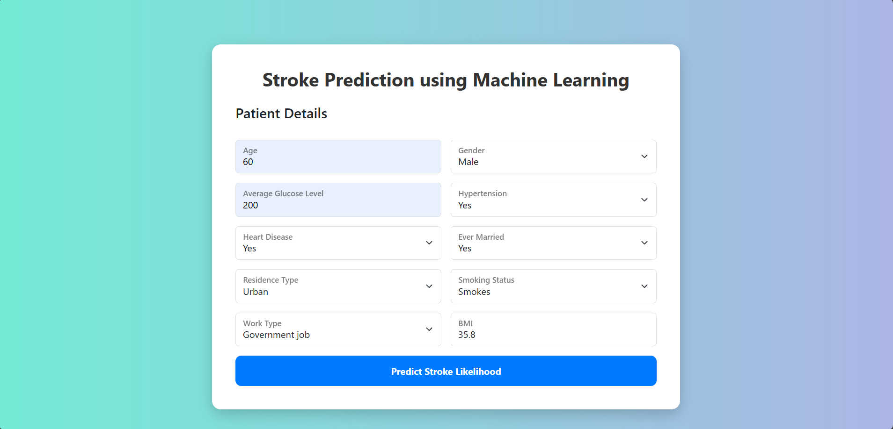
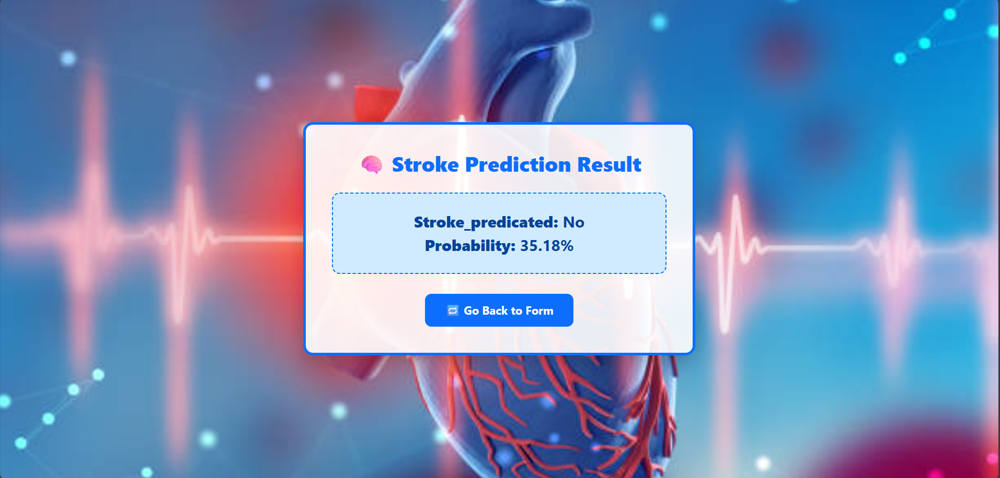
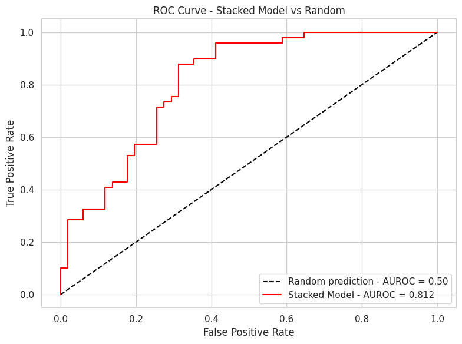

# 🧠 Stroke Prediction Using Machine Learning

A machine learning-based stroke prediction system designed to help identify high-risk patients early using Random Forest and ensemble techniques. This project aims to integrate predictive modeling into healthcare analytics for timely intervention and better patient outcomes.

---

## 📊 Abstract

Stroke is a major cause of death and long-term disability. This project focuses on developing a stroke prediction system using Random Forest and ensemble learning methods like Stacking (Bagging + Boosting + LightGBM). The model is trained on a healthcare dataset containing various patient features such as age, hypertension, BMI, and glucose levels. Class imbalance is handled with oversampling and undersampling methods like SMOTE and RandomUnderSampler.

---

## 🧠 Web App Overview

## Patient Details Overview

---

## Result Overview

---

This project includes a **Flask-based web application** that allows users (doctors, health workers, or patients) to enter patient details and get a **stroke prediction** instantly using a trained machine learning model.

Users can input:
- Age, Gender, BMI, Glucose level
- Heart disease, Hypertension status
- Work type, Smoking status
- And more...

### ⚙️ Built With
- Python 🐍
- Flask 🌐
- HTML + CSS + Bootstrap 🎨
- Scikit-learn, LightGBM, Imbalanced-learn 📊
- Joblib (for loading trained model)

### 📥 Prediction Output
- Prediction (Stroke / No Stroke)
- Probability Score

---

## 📁 Dataset

The dataset includes the following features:

- **Demographics:** Age, Gender, Residence Type, Marital Status  
- **Health Conditions:** Hypertension, Heart Disease, Avg Glucose Level, BMI  
- **Lifestyle:** Smoking Status, Work Type  
- **Target:** Stroke (1 = stroke, 0 = no stroke)

---

## ⚙️ Methodology

### ✔️ Preprocessing

- Categorical encoding using **One-Hot Encoding**  
- **MinMax Scaling** for numerical features

### ✔️ Balancing the Data

- **SMOTE** (Oversampling minority class)  
- **Random UnderSampling**  
✅ Best results achieved when balancing is applied **before splitting** the data

### ✔️ Feature Selection

- **Recursive Feature Elimination (RFE)** using Random Forest to select top features:  
  `avg_glucose_level`, `age`, `bmi`, etc.

### ✔️ Model Training

- 🔍 **Random Forest** as the base classifier  
- 🔄 **Ensemble Learning**:  
  - **Bagging:** Random Forest  
  - **Boosting:** LightGBM  
  - **Stacking:** Combines predictions from Bagging and Boosting with a meta-classifier

### ✔️ Hyperparameter Tuning

- Done using **GridSearchCV**  
- Parameters tuned:  
  - `n_estimators`, `max_depth`, `min_samples_split` (Random Forest)  

---

## 📈 Evaluation Metrics

- Accuracy  
- Precision  
- Recall  
- F1 Score  
- ROC-AUC Curve

---

## 🧪 Results Summary

| Strategy                        | Model                       | Accuracy | Precision | Recall | F1 Score |
|--------------------------------|-----------------------------|----------|-----------|--------|----------|
| Oversampling (SMOTE) Before Split | Stacking (RF )    | 96%      | 97%       | 94%    | 95%      |
| Undersampling Before Split     | Stacking                    | 78%      | 73%       | 88%    | 80%      |

✅ **Best result:** Using **SMOTE before splitting** with **Stacking (RF + Boosting)**

---

## 📉 ROC Curve (Stacked Model vs Random)

---

## 🧠 Conclusion

- **Random Forest**, when paired with RFE and proper tuning, offers strong predictive performance.  
- **Stacking (Bagging + Boosting + LightGBM)** outperforms individual models.  
- Applying **SMOTE before splitting** leads to the most reliable performance on imbalanced datasets.  
- This pipeline can be integrated into real-world healthcare systems for early stroke detection.

---

## 📚 References

- Guhdar et al. (2023), _"Stroke Prediction Using ML"_  
- Dritsas & Trigka (2022), _"Naive Bayes and SMOTE"_  
- IEEE, MDPI, and Nature publications on stroke prediction

---

## 👨‍💻 Authors

- **Sudhir Chouhan** — [sudhirc377@gamil.com](mailto:sudhirc377@gamil.com)  - [LinkedIn](www.linkedin.com/in/sudhir-chouhan-810860281)
- **Vaibhav Pratap Singh** — [vaibhavpsinghsng@gmail.com](mailto:vaibhavpsinghsng@gmail.com)  - [LinkedIn](https://www.linkedin.com/in/vaibhav-pratap-singh-nitjsr)
- **Supervisor:** Dr. Suchismita Mahato, Department of CSE, NIT Jamshedpur
